# Hey, I'm Jordi!

---

I am currently studying computer engineering at the University of Lleida (Spain). Passionate about new technologies and motivated to keep learning every day.

---

Frontend Development

<a href="https://developer.mozilla.org/es/docs/Web/CSS" target="_blank"> 
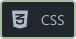 
</a>
<a href="https://es.reactjs.org/" target="_blank"> 
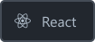 
</a>
<a href="https://es.redux.js.org/" target="_blank"> 
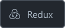 
</a>

Backend Development

<a href="https://nodejs.org/es/" target="_blank"> 
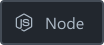 
</a>
<a href="http://expressjs.com/" target="_blank"> 
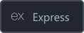 
</a>

<a href="https://socket.io/" target="_blank"> 
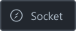 
</a>

<a href="https://www.chaijs.com/" target="_blank"> 
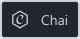 
</a>

Data Analysis

<a href="https://numpy.org/" target="_blank"> 
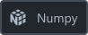 
</a>
<a href="https://pandas.pydata.org/" target="_blank"> 
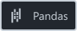 
</a>

Programming Languages

<a href="https://docs.microsoft.com/en-us/dotnet/csharp/" target="_blank"> 
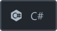 
</a>
<a href="https://www.java.com/es/" target="_blank"> 
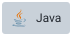 
</a>
<a href="https://developer.mozilla.org/es/docs/Web/JavaScript" target="_blank"> 
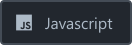 
</a>
<a href="https://www.python.org/" target="_blank"> 
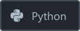 
</a>

Software

<a href="https://www.figma.com/" target="_blank"> 
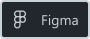 
</a>
<a href="https://www.blackmagicdesign.com/es/products/davinciresolve/" target="_blank"> 
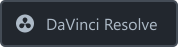 
</a>
<a href="https://www.adobe.com/es/products/aftereffects.html" target="_blank"> 
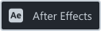 
</a>

