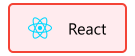

### Hi there

## Technologies I use

#### Frontend Development
<table>
  <tr>
    <td align="center" valign="middle">
      
    </td>
    <td align="left" valign="middle" width=100>HTML</td>
    <td align="left" valign="middle">
      
    </td>
    <td align="left" valign="middle" width=100>CSS</td>
    <td align="left" valign="middle">
      
    </td>
    <td align="left" valign="middle" width=100>React</td>
    <td align="left" valign="middle">
      
    </td>
    <td align="left" valign="middle" width=100>Redux</td>
  </tr>
  <tr>
    <td align="left" valign="middle">
      
    </td>
    <td align="left" valign="middle" width=100>Bootstrap</td>
    <td align="left" valign="middle">
      
    </td>
    <td align="left" valign="middle" width=100>Sass</td>
    <td align="left" valign="middle">
      
    </td>
    <td align="left" valign="middle" width=100>D3</td>
  </tr>
</table>

#### Backend Development
<table>
  <tr>
    <td align="left" valign="middle">
      
    </td>
    <td align="left" valign="middle" width=100>Node</td>
    <td align="left" valign="middle">
      
    </td>
    <td align="left" valign="middle" width=100>Express</td>
    <td align="left" valign="middle">
      
    </td>
    <td align="left" valign="middle" width=100>MongoDB</td>
    <td align="left" valign="middle">
      
    </td>
    <td align="left" valign="middle" width=100>Mongoose</td>
  </tr>
  <tr>
    <td align="left" valign="middle">
      
    </td>
    <td align="left" valign="middle" width=100>Socket</td>
    <td align="left" valign="middle">
      
    </td>
    <td align="left" valign="middle" width=100>Mocha</td>
    <td align="left" valign="middle">
      
    </td>
    <td align="left" valign="middle" width=100>Chai</td>
  </tr>
</table>

#### Data Analysis
<table>
  <tr>
    <td align="left" valign="middle">
      
    </td>
    <td align="left" valign="middle" width=100>Numpy</td>
    <td align="left" valign="middle">
      
    </td>
    <td align="left" valign="middle" width=100>Pandas</td>
    <td align="left" valign="middle">
      
    </td>
    <td align="left" valign="middle" width=100>Seaborn</td>
    <td align="left" valign="middle">
      
    </td>
    <td align="left" valign="middle" width=100>Matplotlib</td>
  </tr>
  <tr>
    <td align="left" valign="middle">
      
    </td>
    <td align="left" valign="middle" width=100>Tensorflow</td>
  </tr>
</table>

#### Programming Languages
<table>
  <tr>
    <td align="left" valign="middle">
      
    </td>
    <td align="left" valign="middle" width=100>C</td>
    <td align="left" valign="middle">
      
    </td>
    <td align="left" valign="middle" width=100>C#</td>
    <td align="left" valign="middle">
      
    </td>
    <td align="left" valign="middle" width=100>Javascript</td>
    <td align="left" valign="middle">
      
    </td>
    <td align="left" valign="middle" width=100>Python</td>
  </tr>
  <tr>
    <td align="left" valign="middle">
      
    </td>
    <td align="left" valign="middle" width=100>Regex</td>
  </tr>
</table>

#### Software
<table>
  <tr>
    <td align="left" valign="middle">
      
    </td>
    <td align="left" valign="middle" width=100>Arduino</td>
    <td align="left" valign="middle">
      
    </td>
    <td align="left" valign="middle" width=100>Unity</td>
    <td align="left" valign="middle">
      
    </td>
    <td align="left" valign="middle" width=100>Blender</td>
    <td align="left" valign="middle">
      
    </td>
    <td align="left" valign="middle" width=100>Inkscape</td>
  </tr>
  <tr>
    <td align="left" valign="middle">
      
    </td>
    <td align="left" valign="middle" width=100>Figma</td>
    <td align="left" valign="middle">
      
    </td>
    <td align="left" valign="middle" width=100>Resolve</td>
    <td align="left" valign="middle">
      
    </td>
    <td align="left" valign="middle" width=100>AE</td>
    <td align="left" valign="middle">
      
    </td>
    <td align="left" valign="middle" width=100>Illustrator</td>
  </tr>
</table>
