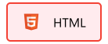
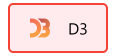
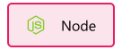
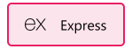
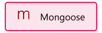
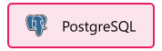
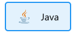
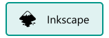
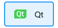
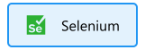

# Hey, I'm Jordi!

---

I am currently studying computer engineering at University of Lleida (Spain). Passionate about new technologies and motivated to keep learning every day.

---

### Frontend Development

 
 
 
 
 
 

### Backend Development

 
 
 
 
 
 

### Data Analysis & AI

 
 
 
 
 

### Programming Languages

 
 
 
 
 
 
 

### Software & Others

 
 
 
 
 
 
 
 
 
 
 
 
 
 
 
 