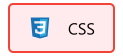
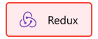
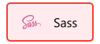
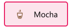
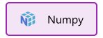
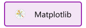
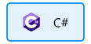

# Hey, I'm Jordi!

---

I am currently studying computer engineering at the University of Lleida (Spain). Passionate about new technologies and motivated to keep learning every day.

---

### Frontend Development

### Backend Development

### Data Analysis

### Programming Languages

### Software

