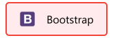
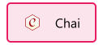
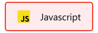
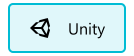

# Hey, I'm Jordi!

---

I am currently studying computer engineering at the University of Lleida (Spain). Passionate about new technologies and motivated to keep learning every day.

---

Frontend Development

Backend Development

Data Analysis

Programming Languages

Software

